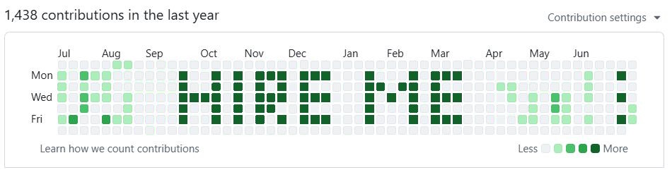

# About
This script generates commit activity in the shape of the text **"HIRE ME"** on your GitHub contribution graph.

### How to install
* Install Git 
* Go to the project folder, example `/var/www/hireme/`
* `git clone git@github.com:mdomansky/hireme.git`
* Check that `git pull` works correct

### How to cron
* `crontab -e`
* add `0 9 * * * cd /var/www/hireme/ && /bin/bash /var/www/hireme/script.sh` for everyday run
